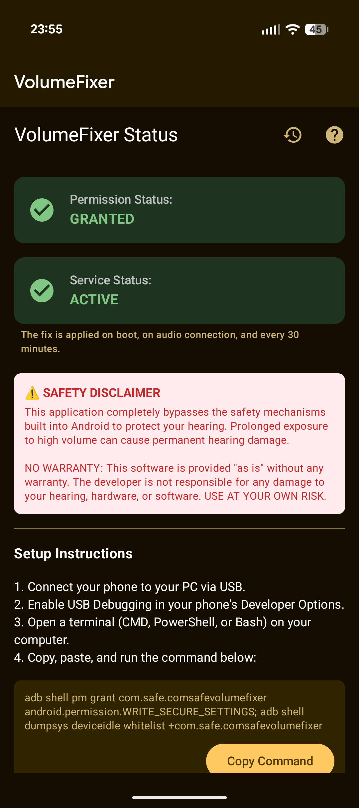
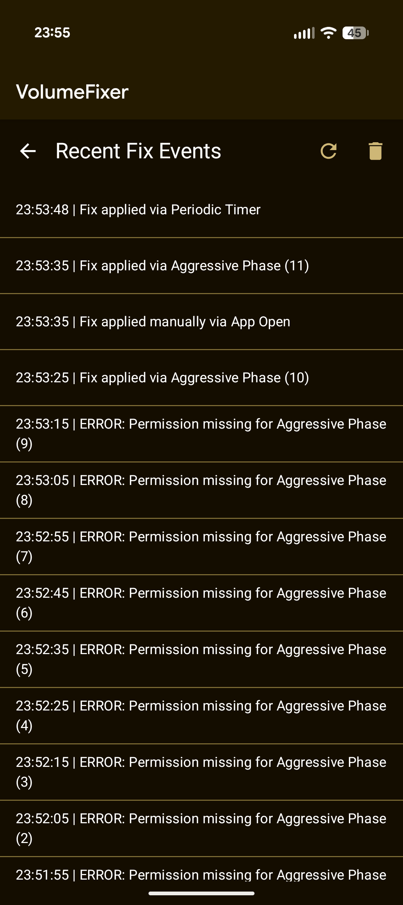
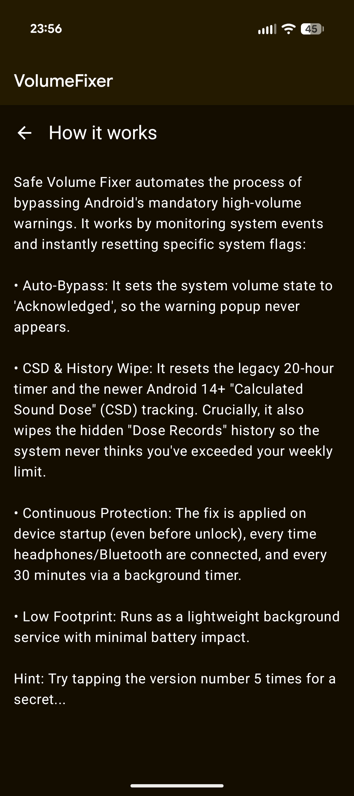

# Safe Volume Fixer 🔊🚫

<p align="center">
  
</p>

**Safe Volume Fixer** is a lightweight Android utility designed to permanently bypass mandatory "Safe Volume" warnings and "Calculated Sound Dose" (CSD) restrictions. 

On many Android devices, the system automatically lowers your volume and displays a popup after 20 hours of listening or when a certain "dose" is reached. This app automates the process of resetting those flags in real-time, ensuring your audio experience is never interrupted.

## ✨ Features

*   **Auto-Bypass**: Instantly suppresses the "High volume can damage your hearing" popup.
*   **CSD History Wipe**: Clears the Android 14+ "Calculated Sound Dose" records to prevent weekly volume capping.
*   **Real-Time Monitoring**: Uses a system watcher to detect if Android tries to sneakily reset restrictions and fixes them instantly.
*   **"Rage Mode" Protection**: Hardened against system spam attacks—if the system tries to force the setting back rapidly, the app counters it instantly.
*   **Persistence**: Automatically applies fixes on device boot, wired headphone connection, and Bluetooth pairing.
*   **Low Footprint**: Runs as a highly optimized background service with negligible battery impact.
*   **Privacy First**: No internet permissions, no data collection. Everything happens locally on your device.

## 📸 Screenshots

<p align="center">
  
  
</p>

## 🛠️ Setup Instructions (ADB Required)

Because this app modifies protected system settings, Android requires you to grant it a special permission via ADB (Android Debug Bridge).

1.  **Download & Install**: Sideload the latest APK onto your phone.
2.  **Enable Debugging**: Go to *Settings > Developer Options* and enable **USB Debugging**.
3.  **Connect to PC**: Plug your phone into your computer.
4.  **Run Command**: Open a terminal (CMD, PowerShell, or Bash) and run the following:

```bash
adb shell pm grant com.safe.comsafevolumefixer android.permission.WRITE_SECURE_SETTINGS; adb shell dumpsys deviceidle whitelist +com.safe.comsafevolumefixer
```

## 🎮 Easter Egg
Feeling bored? Scroll to the bottom of the app dashboard and tap the **Version Number** 5 times to launch a hidden mini-game: **Volume Defense!**

## ⚠️ Safety Disclaimer
**USE AT YOUR OWN RISK.** This application completely bypasses the safety mechanisms built into Android to protect your hearing. Prolonged exposure to high volume can cause permanent hearing damage.

**NO WARRANTY**: This software is provided "as is" without any warranty. The developer is not responsible for any damage to your hearing, hardware, or software. By using this app, you acknowledge that you have been warned.

## 📜 License
This project is licensed under the MIT License.
