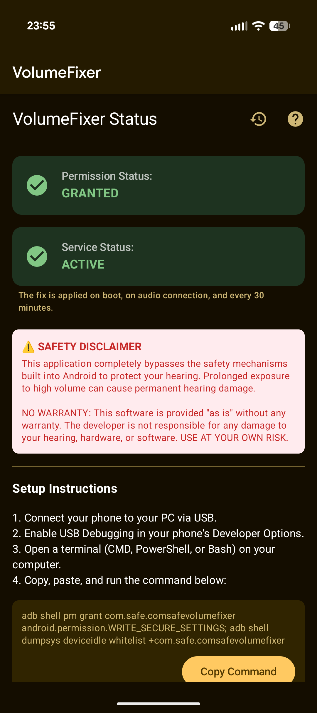
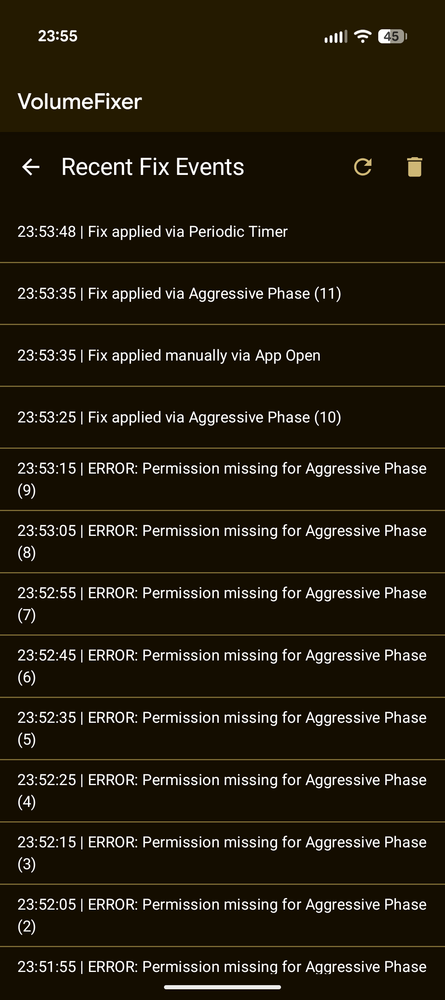
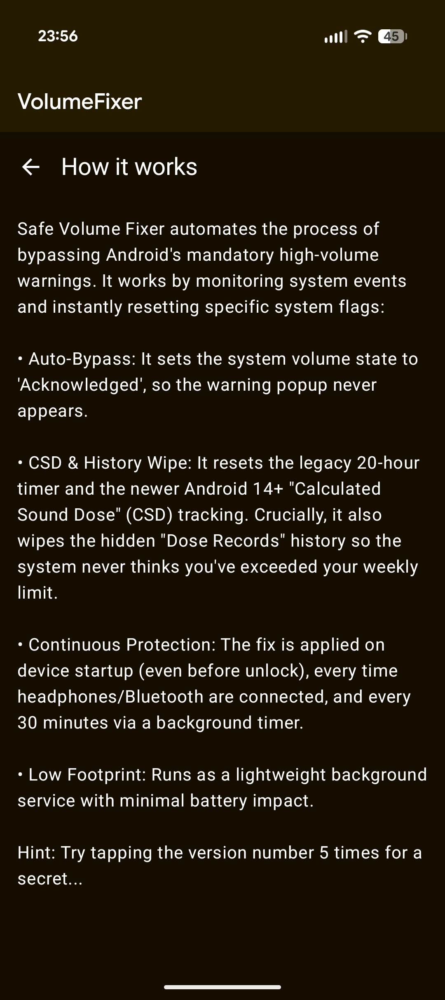

# Safe Volume Fixer

Safe Volume Fixer is a lightweight Android utility designed to permanently bypass mandatory "Safe Volume" warnings and "Calculated Sound Dose" (CSD) restrictions. 

On many Android devices, the system automatically lowers your volume and displays a popup after 20 hours of listening or when a certain "dose" is reached. This app automates the process of resetting those flags in real-time, ensuring your audio experience is never interrupted.

## Why use this?
If you are looking for a way to disable the Android high volume warning without root, this is the solution. It is designed to:
* Stop Android from automatically lowering volume during long listening sessions.
* Permanently dismiss the hearing safety popup that appears on Samsung, Pixel, and other devices.
* Bypass the Android 14 and 15 "Calculated Sound Dose" limits via background memory flushing.
* Bypass OEM-specific restrictions like the Samsung media volume limit.

## Features

* Auto-Bypass: Instantly suppresses the "High volume can damage your hearing" popup by continuously resetting global restriction flags.
* Media Volume Guard: Monitors the android.media.VOLUME_CHANGED_ACTION broadcast. Automatically detects system-forced volume drops (e.g., HAL attenuation) without physical button presses and restores the media volume to its previous level.
* 60-Second CSD Force-Flush: Clears Android 14+ "Calculated Sound Dose" memory and log records every 60 seconds to prevent the background SoundDoseHelper from accumulating exposure time.
* Audio Focus Un-Ducking: Automatically clears stuck audio ducking (where media stays quiet after a notification finishes) by requesting and abandoning a transient audio focus request.
* Hardware & State Triggers: Actively flushes volume limitations upon device boot, direct boot, screen unlock, wired headphone connection, USB-C DAC hotplugging, Bluetooth ACL links, A2DP playback states, and LE Audio/Auracast connections.
* Real-Time Monitoring: Uses a ContentObserver to detect if Android attempts to write to volume safety settings and counters it instantly.
* High Resilience: Runs as an optimized background service using START_STICKY, onTaskRemoved restart handling, and Direct Boot awareness to survive memory pressure and device reboots.

## Understanding the Logs

The app includes a dedicated History screen to help you monitor system behavior. Each fix cycle is separated by a divider and logged with two primary components:
* TRIGGER: The specific system event or broadcast that initiated the fix (e.g., `System Watcher`, `Bluetooth Playback Unpaused`, `Screen Unlocked`, `Auto Volume Drop Guard`).
* ACTION: Confirmation of the resolution, such as `Forced safety flags to UNRESTRICTED` or `Restored Music Volume back to X`.

## Gallery

<p align="center">
  
  
  
</p>

## Setup Instructions (ADB Required)

Because this app modifies protected system settings, Android requires you to grant it a special permission via ADB (Android Debug Bridge).

1. Download & Install: Sideload the latest APK onto your phone.
2. Enable Debugging: Go to Settings > Developer Options and enable USB Debugging or Wireless Debugging.
3. Connect to PC: Connect your phone to your computer via USB or ADB network pairing.
4. Run Command: Open a terminal (CMD, PowerShell, or Bash) and run the following commands:

```bash
adb shell pm grant com.safe.comsafevolumefixer android.permission.WRITE_SECURE_SETTINGS
adb shell dumpsys deviceidle whitelist +com.safe.comsafevolumefixer
```

## Safety Disclaimer
USE AT YOUR OWN RISK. This application completely bypasses the safety mechanisms built into Android to protect your hearing. Prolonged exposure to high volume can cause permanent hearing damage.

NO WARRANTY: This software is provided "as is" without any warranty. The developer is not responsible for any damage to your hearing, hardware, or software. By using this app, you acknowledge that you have been warned.

## License
This project is licensed under the MIT License.
